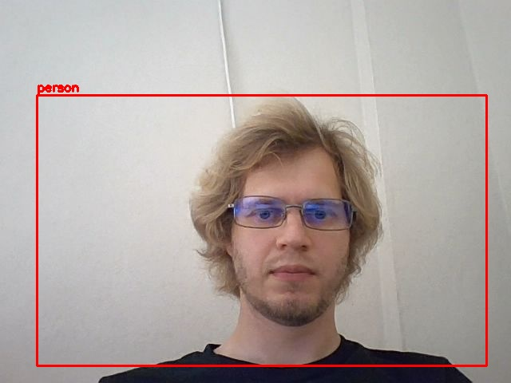

# YOLOv3-in-Colab
YOLOv3 Darknet implementation in Colab  
 

 
 
<a href="https://drive.google.com/file/d/1hCTJDJLEzWrL-Y7gUm8k1kui-xtyJt5M/view">Download weights from gdrive</a>

 
 
Results sample:
 
 

